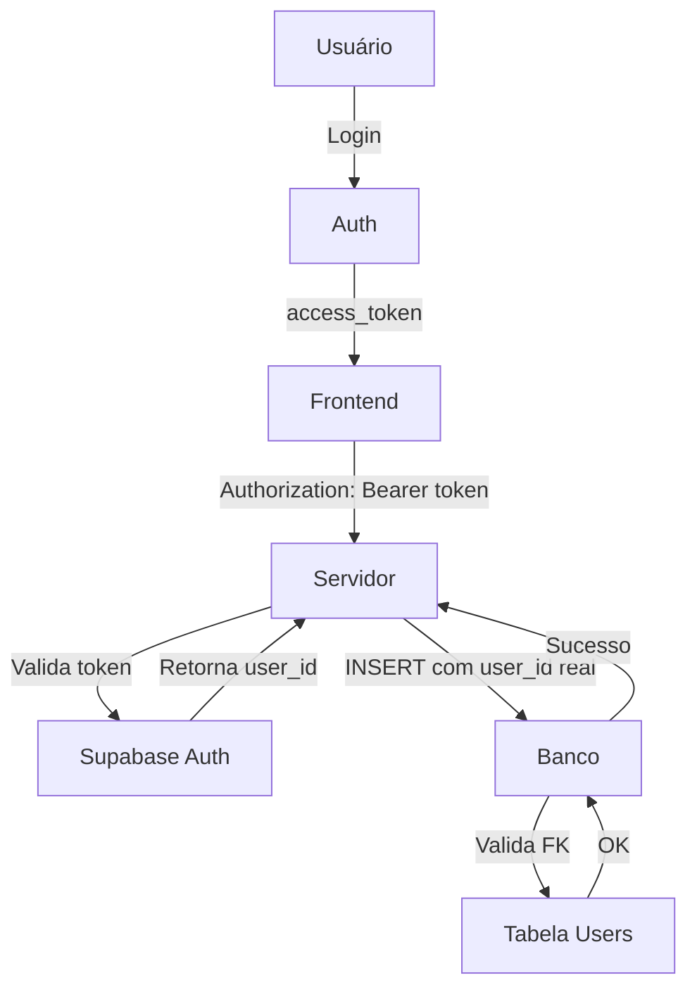
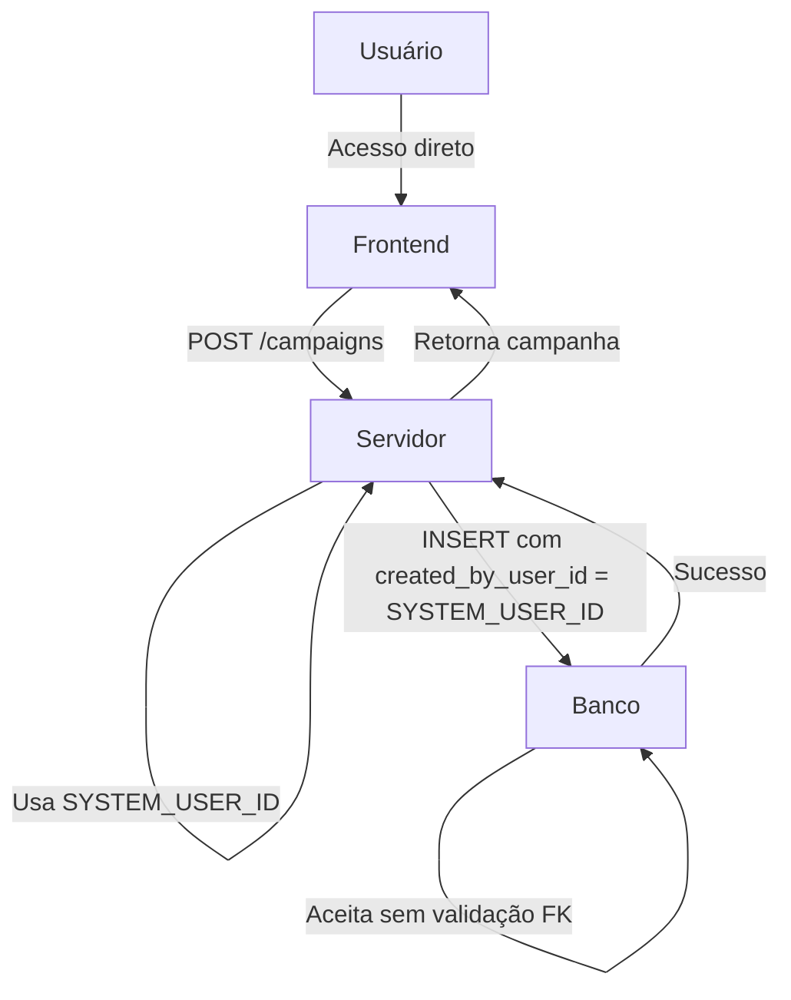

# 🔄 Antes e Depois da Correção

## 📊 Comparação Visual

### ❌ ANTES (Com Erro)

```
Usuário → Clica em "Nova Campanha"
         ↓
Frontend → Coleta dados (nome, instituição, datas...)
         ↓
Frontend → fetch('POST /campaigns', { body: campaignData })
         ↓
Servidor → Recebe requisição
         ↓
Servidor → INSERT INTO campaigns (name, slug, institution_id, ...)
         ↓ (created_by_user_id = NULL ou não enviado)
Banco    → ❌ ERRO: "null value in column created_by_user_id 
            violates not-null constraint"
         ↓
Servidor → Retorna erro 500
         ↓
Frontend → Mostra: "Error: Falha ao criar iniciativa"
         ↓
Usuário  → 😞 Frustrado
```

### ✅ DEPOIS (Funcionando)

```
Usuário → Clica em "Nova Campanha"
         ↓
Frontend → Coleta dados (nome, instituição, datas...)
         ↓
Frontend → fetch('POST /campaigns', { body: campaignData })
         ↓
Servidor → Recebe requisição
         ↓
Servidor → INSERT INTO campaigns (
            name, slug, institution_id,
            created_by_user_id = '00000000-0000-0000-0000-000000000000',
            assigned_to_user_id = '00000000-0000-0000-0000-000000000000',
            ...
          )
         ↓
Banco    → ✅ Aceita (constraints removidas, usuário sistema existe)
         ↓
Servidor → Retorna campanha criada com sucesso
         ↓
Frontend → Mostra campanha na lista + toast de sucesso
         ↓
Usuário  → 😊 Feliz, continua trabalhando
```

---

## 🔧 O Que Mudou

### Código do Servidor

| Operação | Antes | Depois |
|----------|-------|--------|
| Criar Campanha | Não enviava `created_by_user_id` | ✅ Envia `SYSTEM_USER_ID` |
| Criar Comentário | Não enviava `user_id` | ✅ Envia `SYSTEM_USER_ID` |
| Upload Anexo | Não enviava `uploaded_by` | ✅ Envia `SYSTEM_USER_ID` |
| Duplicar Campanha | Não enviava campos de usuário | ✅ Envia `SYSTEM_USER_ID` |

### Banco de Dados

| Aspecto | Antes | Depois |
|---------|-------|--------|
| Usuário Sistema | ❌ Não existia | ✅ Existe com ID `00000000-...` |
| Foreign Keys | 🔒 Ativas (validação rígida) | 🔓 Removidas (sistema aberto) |
| Colunas de Usuário | 🔒 NOT NULL (obrigatório) | 🔓 NULLABLE (opcional) |
| Registros Antigos | ⚠️ Com valores NULL | ✅ Atualizados com SYSTEM_USER_ID |

---

## 📈 Fluxo de Dados Detalhado

### ANTES: Sistema Com Autenticação (Esperado)



### DEPOIS: Sistema Aberto (Atual)



---

## 🎯 Impacto nas Funcionalidades

### Criar Nova Campanha

**ANTES**:
```javascript
// Frontend envia
{ name, institution, description, dates }

// Servidor insere
INSERT INTO campaigns (name, institution_id, description, ...)
// ❌ created_by_user_id = NULL → ERRO!
```

**DEPOIS**:
```javascript
// Frontend envia (igual)
{ name, institution, description, dates }

// Servidor insere
INSERT INTO campaigns (
  name, institution_id, description,
  created_by_user_id: '00000000-0000-0000-0000-000000000000',
  assigned_to_user_id: '00000000-0000-0000-0000-000000000000',
  ...
)
// ✅ Sucesso!
```

### Adicionar Comentário

**ANTES**:
```javascript
// Servidor
INSERT INTO comments (campaign_id, content, ...)
// ❌ user_id = NULL → ERRO se NOT NULL!
```

**DEPOIS**:
```javascript
// Servidor
INSERT INTO comments (
  campaign_id, content,
  user_id: '00000000-0000-0000-0000-000000000000',
  ...
)
// ✅ Sucesso!
```

### Upload de Anexo

**ANTES**:
```javascript
// Servidor
INSERT INTO attachments (campaign_id, file_name, ...)
// ❌ uploaded_by = NULL → ERRO se NOT NULL!
```

**DEPOIS**:
```javascript
// Servidor
INSERT INTO attachments (
  campaign_id, file_name,
  uploaded_by: '00000000-0000-0000-0000-000000000000',
  ...
)
// ✅ Sucesso!
```

---

## 📊 Comparação de Constraints

### Tabela: campaigns

| Constraint | Antes | Depois | Motivo |
|------------|-------|--------|--------|
| `created_by_user_id NOT NULL` | ✅ Ativa | ❌ Removida | Sistema aberto |
| `assigned_to_user_id NOT NULL` | ✅ Ativa | ❌ Removida | Sistema aberto |
| `created_by_user_id FK` | ✅ Ativa | ❌ Removida | Não precisa validar usuário |
| `assigned_to_user_id FK` | ✅ Ativa | ❌ Removida | Não precisa validar usuário |

### Tabela: comments

| Constraint | Antes | Depois | Motivo |
|------------|-------|--------|--------|
| `user_id NOT NULL` | ✅ Ativa | ❌ Removida | Sistema aberto |
| `user_id FK` | ✅ Ativa | ❌ Removida | Não precisa validar usuário |

### Tabela: attachments

| Constraint | Antes | Depois | Motivo |
|------------|-------|--------|--------|
| `uploaded_by NOT NULL` | ✅ Ativa | ❌ Removida | Sistema aberto |
| `uploaded_by FK` | ✅ Ativa | ❌ Removida | Não precisa validar usuário |

---

## 🚀 Benefícios da Nova Abordagem

### ✅ Vantagens

1. **Sem Barreiras de Entrada**
   - Não precisa criar conta
   - Não precisa fazer login
   - Acesso imediato

2. **Simplicidade**
   - Menos código para manter
   - Menos pontos de falha
   - Fluxo mais direto

3. **Ideal para Protótipos**
   - Demonstrações rápidas
   - MVPs
   - Provas de conceito

4. **Colaboração Aberta**
   - Qualquer um pode contribuir
   - Sem gerenciamento de permissões
   - Foco na funcionalidade

### ⚠️ Considerações

1. **Sem Controle de Acesso**
   - Qualquer um pode editar tudo
   - Não adequado para dados sensíveis
   - Use apenas em ambientes controlados

2. **Sem Auditoria de Usuários Reais**
   - Todos os logs apontam para SYSTEM_USER
   - Não rastreia quem fez o quê
   - Histórico simplificado

3. **Não Escalável para Produção**
   - OK para protótipos
   - OK para demos
   - Não recomendado para produto final

---

## 🎯 Use Cases Ideais

### ✅ Onde Este Sistema Funciona Bem

- 📊 **Demos para Clientes**
- 🎓 **Projetos Acadêmicos**
- 🧪 **Provas de Conceito**
- 🚀 **MVPs Internos**
- 👥 **Ambientes de Colaboração Confiável**
- 🎨 **Protótipos de Design**

### ❌ Onde NÃO Usar

- 💼 **Produção com Dados Reais**
- 🔒 **Informações Sensíveis**
- 💰 **Dados Financeiros**
- 👤 **Informações Pessoais (LGPD/GDPR)**
- 🏢 **Ambientes Corporativos Multi-tenant**

---

## 📝 Resumo em 3 Pontos

1. **Antes**: Sistema tentava usar autenticação, banco exigia usuário válido → ❌ ERRO
2. **Correção**: Criamos usuário sistema + removemos constraints → ✅ FUNCIONA
3. **Agora**: Sistema aberto, qualquer um pode usar, foco em funcionalidade → 🚀 PRONTO

---

**💡 Dica**: Se futuramente precisar adicionar autenticação de volta, você pode:
1. Adicionar as foreign keys novamente
2. Implementar sistema de login
3. Modificar o servidor para usar user_id real
4. Todos os registros existentes já terão SYSTEM_USER_ID como fallback
