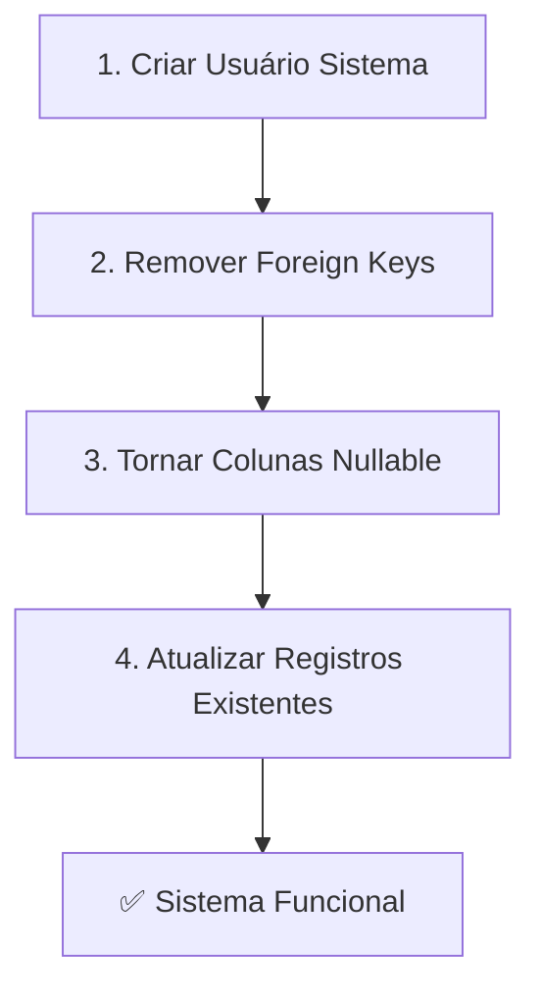

# 🔴 CORREÇÃO CRÍTICA - RESUMO EXECUTIVO

## 🎯 Problema
```
Error: "insert or update on table campaigns violates foreign key constraint 
campaigns_created_by_user_id_fkey"
```

## ✅ Solução Aplicada

### 1️⃣ Código do Servidor (✅ JÁ CORRIGIDO)
Arquivos atualizados automaticamente:
- `/supabase/functions/server/index.tsx`

**O que foi feito:**
- ✅ Criação de campanhas agora envia `created_by_user_id` e `assigned_to_user_id`
- ✅ Criação de comentários agora envia `user_id`
- ✅ Upload de anexos agora envia `uploaded_by`
- ✅ Duplicação de campanhas usa SYSTEM_USER_ID
- ✅ Todos os valores apontam para: `00000000-0000-0000-0000-000000000000`

### 2️⃣ Banco de Dados (⏳ AGUARDANDO SUA AÇÃO)

**VOCÊ PRECISA EXECUTAR UM DOS SCRIPTS SQL:**

#### Opção Rápida ⚡ (30 segundos)
→ Arquivo: `/quick_fix.sql`
→ Apenas 4 etapas essenciais:
1. Cria usuário sistema
2. Remove foreign keys
3. Torna colunas nullable
4. Atualiza registros existentes

#### Opção Completa 🔧 (2 minutos)
→ Arquivo: `/database_fix.sql`
→ 14 etapas incluindo:
- Tudo da opção rápida +
- Triggers otimizados
- Views sem dependências de usuário
- Dados iniciais (instituições e tags)
- Verificações de integridade

## 🚀 EXECUTE AGORA

### Passo a Passo (Supabase Dashboard):
```
1. Abra: https://supabase.com/dashboard
2. Clique no seu projeto
3. Menu lateral → SQL Editor
4. New query
5. Cole o conteúdo de /quick_fix.sql OU /database_fix.sql
6. Run (Ctrl/Cmd + Enter)
7. ✅ Sucesso! Teste criar uma campanha
```

## 📊 Ordem de Execução do Script



## 🔍 Por Que o Erro Aconteceu?

### Antes:
```
Código → Envia created_by_user_id = NULL
Banco → Rejeita (NOT NULL constraint)
```

### Correção 1:
```
Código → Envia created_by_user_id = '00000000-0000-0000-0000-000000000000'
Banco → Rejeita (Foreign Key constraint - usuário não existe!)
```

### Depois da Correção 2:
```
Script SQL → Cria usuário sistema PRIMEIRO
Script SQL → Remove foreign keys (sistema sem autenticação)
Código → Envia created_by_user_id = '00000000-0000-0000-0000-000000000000'
Banco → ✅ Aceita sem problemas!
```

## 🎯 Resultado Final

Depois de executar o script:
- ✅ Criar campanhas funciona
- ✅ Adicionar comentários funciona
- ✅ Upload de anexos funciona
- ✅ Duplicar campanhas funciona
- ✅ Editar campanhas funciona
- ✅ Sistema 100% operacional sem autenticação

## ⚠️ IMPORTANTE

**NÃO PULE ESTA ETAPA!** O sistema NÃO funcionará até que você execute um dos scripts SQL no Supabase.

O código do servidor já está preparado, mas o banco precisa dessa configuração única.

---

**Tempo estimado**: 30 segundos com `/quick_fix.sql`

**Próximo passo**: Execute o script e teste criar uma campanha! 🚀

## 🔍 Como Verificar Se Funcionou

### Opção 1: Teste Manual
Tente criar uma nova campanha no sistema. Se funcionar sem erros, está tudo OK!

### Opção 2: Script de Diagnóstico
Execute o arquivo `/DIAGNOSTIC.sql` no SQL Editor:
- ✅ Verifica se usuário sistema existe
- ✅ Verifica se foreign keys foram removidas
- ✅ Verifica se colunas são nullable
- ✅ Mostra estatísticas do banco
- ✅ Dá um resumo final claro

## 📚 Arquivos de Referência

| Arquivo | Propósito | Quando Usar |
|---------|-----------|-------------|
| `/quick_fix.sql` | Correção rápida (30s) | **Execute este AGORA** |
| `/database_fix.sql` | Correção completa (2min) | Opcional - mais recursos |
| `/DIAGNOSTIC.sql` | Verificar configuração | Depois de executar o fix |
| `/CRITICAL_FIX_SUMMARY.md` | Este documento | Entender o problema |
| `/FIX_DATABASE_NOW.md` | Guia detalhado | Instruções passo a passo |

---

**Última atualização**: Sistema totalmente preparado para funcionar sem autenticação após executar o script SQL. 🎉
